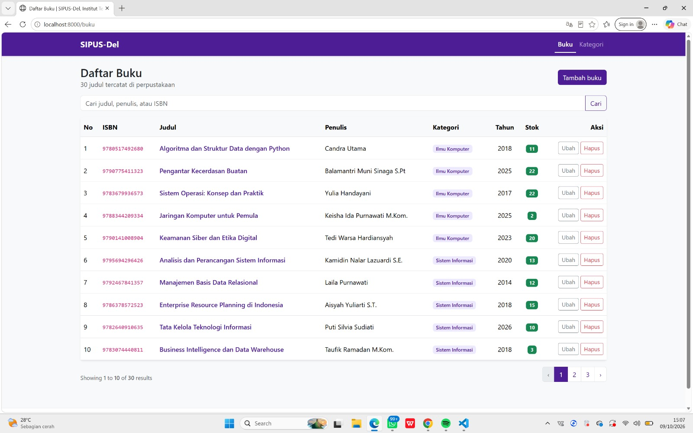
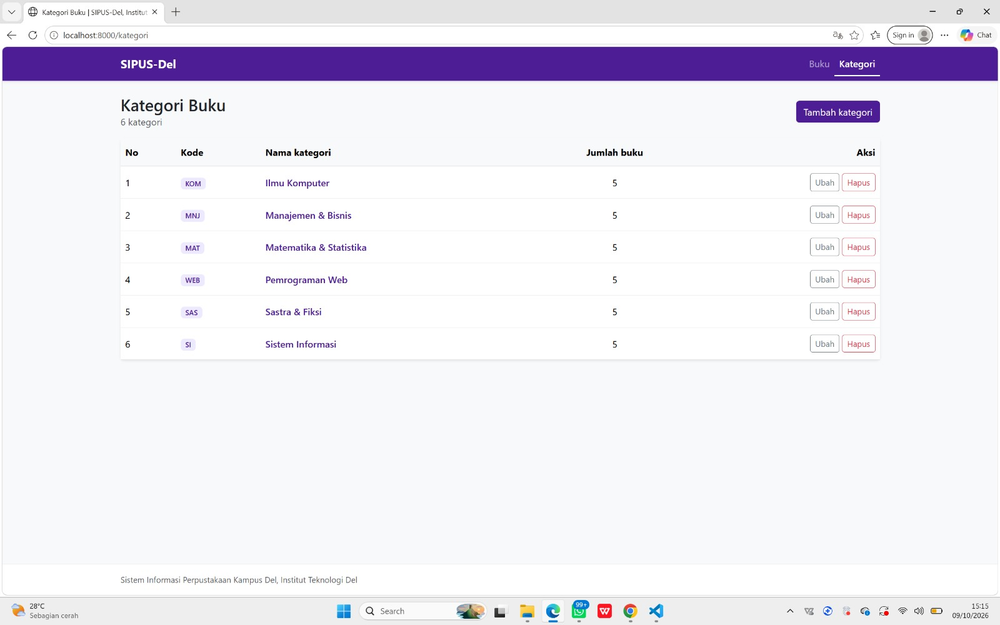
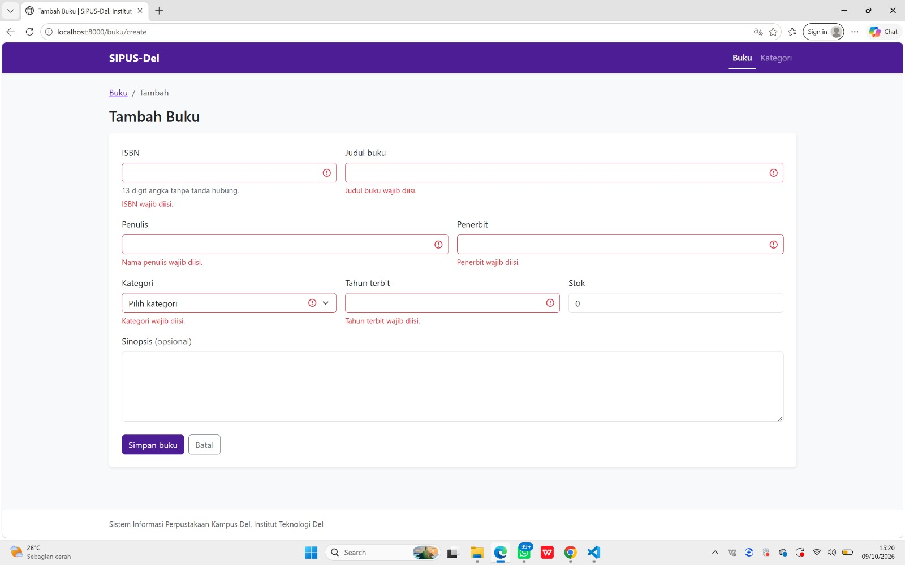
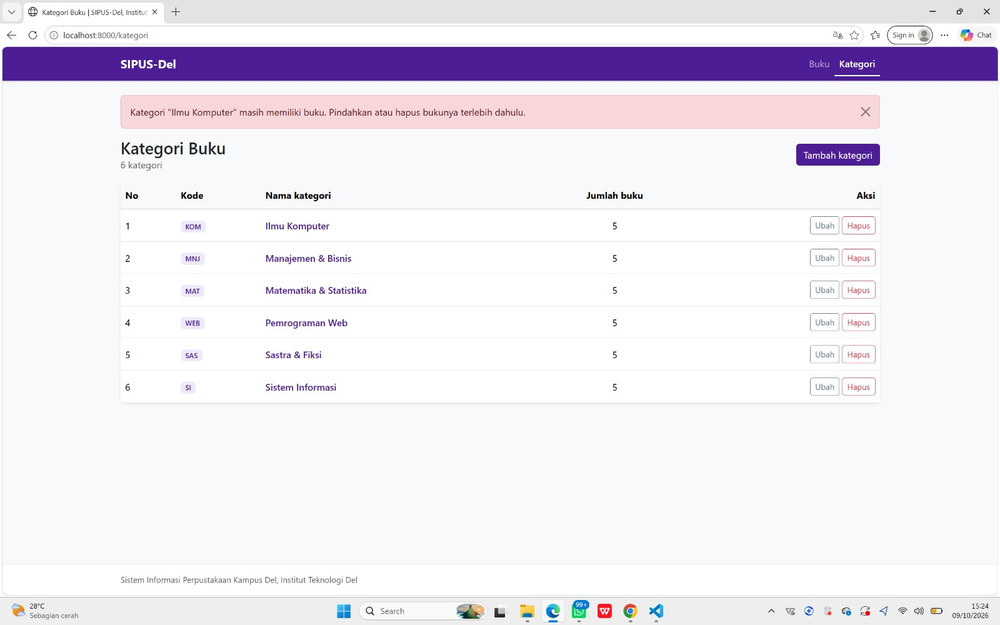

# SIPUS-Del: Sistem Informasi Perpustakaan Kampus Del

Tugas Mandiri Praktikum Minggu 5, Pemrograman & Pengujian Web (12S3101), Institut Teknologi Del.

| | |
|---|---|
| Nama | **Silvia Eklesiana Sitorus** |
| NIM | **12S24004** |
| Program Studi | Sarjana Sistem Informasi |
| Framework | Laravel 13.34.0, PHP 8.4 |

Aplikasi CRUD perpustakaan berbasis **Laravel 13** dengan pola arsitektur MVC, relasi Eloquent One-to-Many (Kategori → Buku), validasi server-side, Blade Components, dan audit kueri SQL untuk membuktikan Eager Loading.

## Fitur

- CRUD lengkap **Buku** dan **Kategori** via `Route::resource()` (7 aksi RESTful masing-masing) dengan Implicit Route Model Binding.
- Relasi `Kategori hasMany Buku` dan `Buku belongsTo Kategori`, proteksi mass assignment dengan `$fillable`.
- Eager Loading `Buku::with('kategori')` di daftar buku dan `withCount('bukus')` di daftar kategori.
- Validasi server-side: ISBN 13 digit dan unik, judul minimal 5 karakter, stok minimal 0, kategori harus ada, dengan pesan galat berbahasa Indonesia.
- Proteksi CSRF (`@csrf`, diverifikasi middleware `PreventRequestForgery` Laravel 13) dan method spoofing (`@method('PUT')`, `@method('DELETE')`) di semua form.
- Master layout `<x-layout>` bertema Del Purple `#4C1D95`, flash message, pagination, `@forelse`, dan pencarian buku.
- Kategori yang masih memiliki buku tidak dapat dihapus (`restrictOnDelete`).
- Seeder + Factory: 6 kategori dan 30 buku realistis (Faker locale `id_ID`).

## Struktur Basis Data

```
kategoris                         bukus
─────────────────────             ──────────────────────────────
id            PK                  id             PK
kode_kategori UNIQUE  ◄──┐        isbn           UNIQUE (13)
nama_kategori UNIQUE     │        judul          INDEX
timestamps               │        penulis        INDEX
                         │        penerbit
                         │        tahun_terbit   SMALLINT UNSIGNED
                         └─────── kategori_id    FK (cascade update / restrict delete)
                                  stok           INT UNSIGNED, default 0
                                  sinopsis       TEXT NULL
                                  timestamps
```

Hasil `php artisan db:table bukus`:

```
Index
  bukus_isbn_unique isbn ................................ unique
  bukus_judul_index judul
  bukus_penulis_index penulis
  primary id ............................................ primary

Foreign Key ................................ On Update / On Delete
  kategori_id references id on kategoris ........ cascade / restrict
```

## Instalasi

Prasyarat: **PHP 8.3+**, Composer 2.6+, Node.js 20+.

```bash
git clone https://github.com/SilviaSitorus12/ppw-2026-week5-12S24004.git
cd ppw-2026-week5-12S24004

composer install
cp .env.example .env
php artisan key:generate

# Buat file database SQLite (PowerShell: New-Item database/database.sqlite)
touch database/database.sqlite

php artisan migrate:fresh --seed

npm install
npm run build

php artisan serve
```

Buka http://localhost:8000.

## Daftar Rute

Hasil `php artisan route:list --except-vendor` (15 rute):

```
GET|HEAD   /                          routes/web.php
GET|HEAD   buku                       buku.index      › BukuController@index
POST       buku                       buku.store      › BukuController@store
GET|HEAD   buku/create                buku.create     › BukuController@create
GET|HEAD   buku/{buku}                buku.show       › BukuController@show
PUT|PATCH  buku/{buku}                buku.update     › BukuController@update
DELETE     buku/{buku}                buku.destroy    › BukuController@destroy
GET|HEAD   buku/{buku}/edit           buku.edit       › BukuController@edit
GET|HEAD   kategori                   kategori.index  › KategoriController@index
POST       kategori                   kategori.store  › KategoriController@store
GET|HEAD   kategori/create            kategori.create › KategoriController@create
GET|HEAD   kategori/{kategori}        kategori.show   › KategoriController@show
PUT|PATCH  kategori/{kategori}        kategori.update › KategoriController@update
DELETE     kategori/{kategori}        kategori.destroy› KategoriController@destroy
GET|HEAD   kategori/{kategori}/edit   kategori.edit   › KategoriController@edit
```

## Tampilan Aplikasi

### Daftar Buku


### Daftar Kategori


### Validasi Server-Side
Form menggunakan atribut `novalidate` sehingga validasi HTML5 dimatikan dan seluruh validasi dilakukan di server lewat `$request->validate()`.



### Proteksi Hapus Kategori
Kategori yang masih memiliki buku ditolak saat dihapus.



## Bukti Audit SQL (Eager Loading)

### 1. Perbandingan Lazy vs Eager Loading

Perintah khusus `php artisan audit:n-plus-one` (didefinisikan di `routes/console.php`):

```
Mengambil 20 buku beserta kategorinya:
  Lazy Loading  : 21 kueri (1 + N)
  Eager Loading : 2 kueri

Detail kueri Eager Loading:
+---+------------+------------------------------------------------------------------+
| # | Waktu (ms) | SQL                                                              |
+---+------------+------------------------------------------------------------------+
| 1 | 0.36       | select * from "bukus" order by "created_at" desc limit 20        |
| 2 | 0.25       | select * from "kategoris" where "kategoris"."id" in (1, 2, 3, 4) |
+---+------------+------------------------------------------------------------------+
```

### 2. Log kueri halaman `/buku` (`storage/logs/laravel.log`)

Listener `DB::listen` di `AppServiceProvider` mencatat setiap kueri. Hasil saat membuka halaman 1 dan halaman 2:

```
[SQL AUDIT] (0.14 ms) select count(*) as "aggregate" from "bukus"
[SQL AUDIT] (0.15 ms) select * from "bukus" order by "created_at" desc limit 10 offset 0
[SQL AUDIT] (0.47 ms) select * from "kategoris" where "kategoris"."id" in (1, 2)
[SQL AUDIT] (0.13 ms) select count(*) as "aggregate" from "bukus"
[SQL AUDIT] (0.21 ms) select * from "bukus" order by "created_at" desc limit 10 offset 10
[SQL AUDIT] (0.10 ms) select * from "kategoris" where "kategoris"."id" in (3, 4)
```

Setiap halaman hanya menjalankan **3 kueri**, berapa pun jumlah bukunya:
1. `count(*)`: menghitung total untuk pagination.
2. `select ... from bukus ... limit 10`: mengambil 10 buku.
3. `select ... from kategoris where id in (...)`: memuat semua kategori sekaligus (eager loading).

Tanpa `with('kategori')`, kueri ketiga akan berjalan 10 kali per halaman (satu kali per buku).

## Keamanan

| Ancaman | Mitigasi |
|---|---|
| Mass Assignment | `$fillable` di model, dan hanya data `$validated` yang disimpan |
| CSRF | `@csrf` di semua form, diverifikasi middleware `PreventRequestForgery` |
| XSS | Output Blade `{{ }}` otomatis di-escape; sinopsis memakai `nl2br(e(...))` |
| SQL Injection | Query Builder dengan parameter binding (`where('judul', 'like', ...)`) |
| Data yatim | Foreign key `restrictOnDelete` + pengecekan di `KategoriController@destroy` |

## Riwayat Commit

Repositori ini menggunakan [Conventional Commits](https://www.conventionalcommits.org/):

1. `chore: initialize laravel 13 project`
2. `feat(migration): create kategoris and bukus tables schema`
3. `feat(model): define relationships and fillable attributes`
4. `feat(seeder): add realistic faker factories for kategori and buku`
5. `feat(controller): implement restful actions and server validation`
6. `feat(views): construct blade component layout and crud templates`
7. `perf(eager-loading): optimize sql queries to prevent n+1 problem`
8. `docs: add installation guide, sql audit evidence, and screenshots`